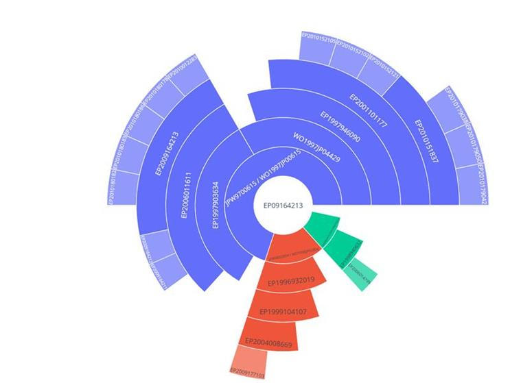

# tip_familyTree
This section introduces the notebook's purpose which is to demonstrate the use of **TIP**, the Technology Intelligence Platform. It is a real life example using data from **OPS**, the Open Patent Services from **EPO**.

By leveraging DiviTree data from Open Patent Services, OPS, and using the sunburst chart of the Plotly library, PatentSpere visually offers a spherical, colourful and dynamic representation of EP / WO divisional patents and their relationships by branches and by parent-child affiliation, that can be zoomed intuitively. 

EP / WO family tree of the patent application EP09164213 in stock at EPO:

